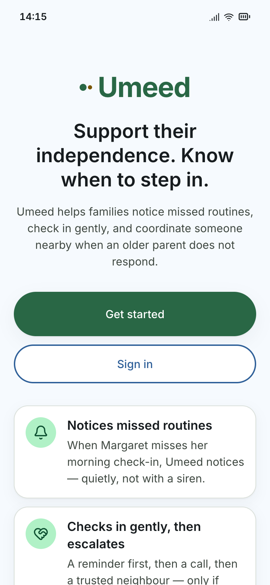

# Umeed

**Notices when an older parent misses a daily routine, checks in gently, and gets a trusted person nearby to respond, without the whole family scrambling.**

Not deployed yet; runs locally (see below).



## The problem

Families of an older parent who lives independently are stuck between two options. Informal daily calls and WhatsApp messages depend on someone remembering, and when a parent goes quiet, either everyone calls at once or nobody does. A monitored personal alarm is the other option, but it is built for emergencies, not for "Mum hasn't confirmed her morning tablets." There is nothing in between that notices a missed routine and coordinates who checks in.

## What it does

- **Routines with gentle reminders,** for example "Morning check-in and tablets" at 9:00.
- **A step-by-step escalation when there's no response:** an in-app reminder, then a call, then a trusted neighbour, then the family coordinator, then the rest of the family. Every timing is configurable.
- **"I'm handling this."** One tap claims an alert, and everyone else can see that someone is on it. If the claim expires, escalation picks up where it left off.
- **"I need help."** The parent can skip the routine steps and alert their neighbour and family straight away, with links to call family, NHS 111 or 999.
- **Consent and permissions controlled by the older adult,** who can see and remove anyone's access.
- **An activity history** of every alert, who responded and what happened.

## Key product decisions

- **Rules, not AI.** Scheduling, escalation, permissions and emergency guidance are all deterministic. Nothing in a safety flow depends on a model's judgement.
- **Silence is a signal, not a diagnosis.** A missed routine triggers a check-in, not an alarm. Umeed never calls emergency services automatically and never gives medical advice.
- **Coordination is the product.** The most important action is "I'm handling this", because the real failure is either duplicated panic or nobody going.
- **A neighbour sees the minimum.** By default they get the parent's first name, the request and a deadline, and nothing about medicines, diagnoses or the family timeline.
- **Nothing starts without the parent's agreement.** A care circle stays inactive until the older adult has consented.
- **No demo shortcuts in the product.** Real sign-in from day one, with no role switchers or sped-up clocks in the interface. Those exist only in automated tests.

## Results & evidence

- Phases 0 to 10 of a 12-phase build plan are complete: real accounts, care circles, consent, routines, escalation, alert claiming and live alert updates.
- 61 automated test files cover the domain rules and complete user journeys, including the main scenario: a parent misses her routine, the neighbour claims the alert, and the family sees it is handled.
- An end-to-end walkthrough found user-journey bugs, which have been fixed.
- Not yet used by real families.

## Scope & limits

- **Not deployed.** Calls and texts are simulated; real phone and SMS delivery is the next phase.
- **The browser-side database connection needs a security redesign** before real use. Server-side sign-in and data work today.
- **Not an emergency service or a medical device.** It does not prove a medicine was taken or guarantee someone is safe.
- **Out of scope by design:** fall detection, wearables, continuous location tracking, medication advice and NHS record access.

## Next in roadmap

- Real phone calls and SMS through Twilio.
- Fix the browser-side database connection, then switch the scheduled escalation job on.
- Deployment and final verification.

<details>
<summary><strong>Tech stack & running locally</strong></summary>

**Stack:** TanStack Start, React, TypeScript, Tailwind CSS, Supabase (Auth, Postgres with Row Level Security, Realtime, Edge Functions, scheduled jobs), Vitest, Bun.

```bash
bun install
cp .env.example .env    # defaults run fully locally with mock communications
bun run dev
bun run test
```

The full product specification is in [Implementation.md](Implementation.md).

</details>
